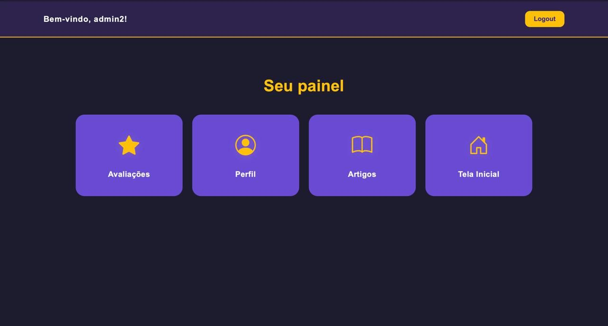

# RicoApp 💰🎮

**Aplicativo de educação financeira gamificada, conceituado nas aulas de Novas Tecnologias na Universidade Católica de Brasília e destinado a atender demandas do Ministério da Fazenda.**




[](https://github.com/MatheusSales2773/Site_Rico/issues)
[](https://github.com/MatheusSales2773/Site_Rico/network)
[](https://github.com/MatheusSales2773/Site_Rico/stargazers)
[](https://opensource.org/licenses/MIT)

## Sobre o Projeto 🎯

O RicoApp surge como uma solução inovadora para o aprendizado de finanças pessoais, utilizando a gamificação como principal ferramenta de engajamento. A ideia foi concebida no ambiente acadêmico da Universidade Católica de Brasília, durante as aulas de Novas Tecnologias, com o objetivo de explorar como a tecnologia pode transformar a educação financeira em uma experiência mais acessível, divertida e eficaz.

Este projeto visa não apenas educar, mas também capacitar os usuários a tomarem decisões financeiras mais conscientes e informadas, com potencial aplicação para atender demandas específicas do Ministério da Fazenda, promovendo a literacia financeira em maior escala.

**Link do Repositório:** [https://github.com/MatheusSales2773/Site_Rico](https://github.com/MatheusSales2773/Site_Rico)

## ✨ Funcionalidades

* **Carregamento Dinâmico de Conteúdo HTML:** Estrutura modular que permite carregar seções da página (como cabeçalho e a página principal) de forma dinâmica, otimizando a organização do código.
* **Homepage Inicial:**
    * **Seção Hero:** Apresentação impactante do aplicativo com texto e imagens.
* **Design Responsivo com Bootstrap:** Layout adaptável para diferentes tamanhos de tela (desktops, tablets e smartphones).
* **Componentização de Elementos:** Arquivos HTML organizados em partes reutilizáveis, como menu e rodapé.
* **Banco de Dados com SQLite:** Armazenamento de informações estruturadas localmente, com potencial para acompanhar dados do usuário ou progresso no aprendizado.
* **Estilo Visual Consistente:** Uso de paleta de cores, tipografia e ícones (via Font Awesome) para manter uma identidade visual clara.
* **Navegação Suave e Interativa:** Animações e transições aplicadas para uma experiência mais fluida.
* **Código Modular e Bem Organizado:** Separação clara entre HTML, CSS, JavaScript e banco de dados.

## 🛠️ Tecnologias Utilizadas

* **HTML5:** Estruturação do conteúdo web.
* **CSS3:** Estilização (potencialmente com foco em componentes Bootstrap).
* **JavaScript:** Interatividade e carregamento dinâmico de conteúdo.
* **Node.js**: Ambiente de execução para JavaScript no servidor.
* **Express.js**: Framework web para gerenciamento de rotas e requisições.
* **Bootstrap 5:** Framework CSS para design responsivo e componentes pré-estilizados.
* **Git & GitHub:** Versionamento e hospedagem do código-fon.
* **Font Awesome:** Ícones vetoriais escaláveis.
* **SQLite:** Banco de dados leve e local, utilizado para armazenamento de dados do aplicativo.
* **Figma:** Para protótipo.

## 🛠️ Instalação e Execução

Para instalar e executar o projeto localmente, siga os passos abaixo:

1. **Clone o repositório:**
   ```bash
   git clone https://github.com/MatheusSales2773/Site_Rico.git
   ```

2. **Navegue até o diretório do projeto:**
   ```bash
   cd Site_Rico
   ```

3. **Instale as dependências:**
   ```bash
   npm install
   ```

4. **Execute o servidor:**
   Se o projeto tiver um servidor configurado (ex.: server.js), execute:
   ```bash
   node server.js
   ```

5. **Abra o aplicativo no navegador:**
   Acesse o endereço local onde o servidor está rodando, geralmente:
   ```
   http://localhost:3000
   ```

## 📜 Licença

Distribuído sob a Licença MIT. Veja LICENSE.txt para mais informações.

## 📞 Contato

Matheus Sales - https://www.linkedin.com/in/matheus-sales-carvalho-037916269/

Link do Projeto: [https://github.com/MatheusSales2773/Site_Rico](https://github.com/MatheusSales2773/Site_Rico)

## 🙏 Agradecimentos

* Colegas que contribuíram com o projeto, ideias e feedbacks
* Universidade Católica de Brasília (UCB) - Disciplina de Novas Tecnologias.
